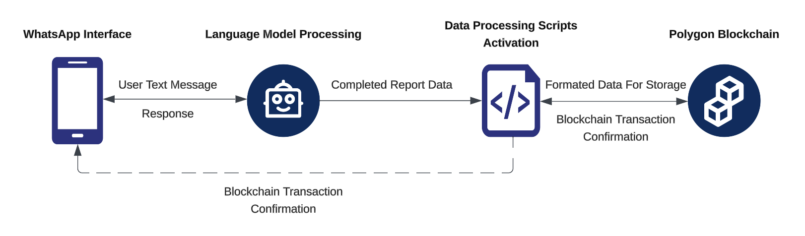

# Architecture Overview

This architecture leverages the WhatsApp Business API for data collection, the ChatGPT API/Lanchain for natural language processing, serverless computing for data processing and validation, and Lanchain for simplified blockchain interactions, culminating in secure data storage on the Polygon blockchain.

## Components

1. **WhatsApp Interface (WhatsApp Business API)**: Serves as the primary communication channel with farmers, capturing emission data via text messages.

2. **Language Model (ChatGPT API)**: Employs natural language understanding to interpret and structure the farmers' messages into a standardized emission data format. This API is crucial for processing conversational inputs into actionable data.

3. **Data Processing Scripts (Serverless Functions)**: These functions, triggered by structured data from the ChatGPT API, perform final validations and format the data for blockchain storage. They are designed to operate on demand, ensuring scalability and cost-efficiency.

4. **Blockchain Interaction Layer (Lanchain or Similar Service)**: Provides a simplified interface for interacting with the Polygon blockchain. It abstracts the complexity of blockchain transactions, allowing serverless scripts to store data on the blockchain with minimal overhead.

5. **Polygon Blockchain**: Immutable storage for emission data, ensuring transparency and security. Smart contracts deployed here manage data validation, storage, and retrieval processes.

## Data Flow

1. **User Interaction**: Initiated via WhatsApp, sending emission data.
   
2. **Language Model Processing**: Receives data, conducts initial processing, and validation.
   
3. **Data Processing Scripts Activation**: Triggered post-validation, formats the data for blockchain storage.
   
4. **Blockchain Transaction**: Scripts interact with Polygon smart contracts, submitting data to the blockchain.

5. **Confirmation & Receipt**: Blockchain transaction confirmation is sent back through the script to the WhatsApp interface, confirming successful storage to the user.

## Key Points

- **Serverless Architecture**: Eliminates the need for traditional backend servers by using serverless computing platforms for data processing and interaction with the blockchain.

- **Smart Contracts**: Deployed on Polygon, handle data structuring, validation, and storage directly on the blockchain.

- **Scalability & Cost-Effectiveness**: Serverless functions scale with demand, optimizing operational costs and efficiency.

